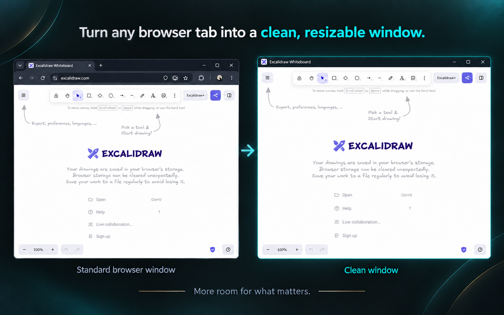
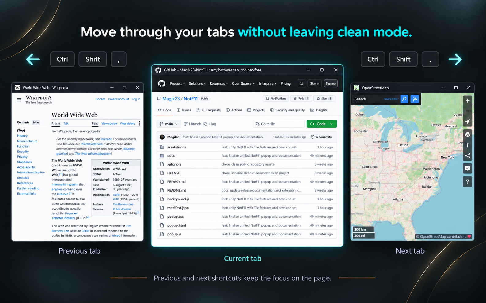
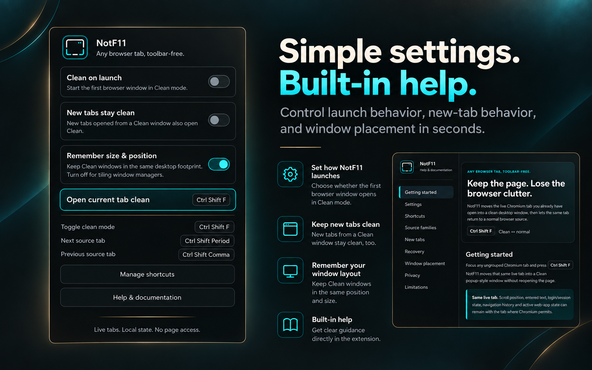

# NotF11

## Any browser tab, toolbar-free.

**Turn the current live Chromium tab into a clean, resizable desktop window — without F11 fullscreen.**

[Get NotF11](https://chromewebstore.google.com/detail/notf11/oepfhdcfbannblllfhcehmjfmdjgdfeh) · [Albenoir Lab](https://albenoir.com/lab/) · [Latest release](https://github.com/Magik23/NotF11/releases/latest)



NotF11 is a lightweight, open-source Chromium extension that moves the browser tab you already have open into a clean window without the tab strip, address bar, bookmarks bar, navigation buttons, or extension controls.

It keeps the **same live tab** instead of reopening its URL. The page stays inside Chromium while the window remains movable, resizable, maximizable, snappable, and usable with normal desktop window-management tools.

**Not fullscreen. Not picture-in-picture. Not app mode. Just the page you were already using, with less browser around it.**

---

## What NotF11 does

Press `Ctrl+Shift+F` on an eligible Chromium tab:

```text
Normal browser tab
        ↓
same live tab
        ↓
Clean window
```

Press it again:

```text
Clean window
        ↓
same live tab
        ↓
normal browser source
```

Because NotF11 moves the existing tab rather than recreating the page from its URL, scroll position, entered text, navigation history, login/session state, and active web-app state can remain with the tab where Chromium permits.

This makes NotF11 useful for:

- AI tools such as ChatGPT
- web apps and dashboards
- documentation and reference pages
- browser-based editors
- productivity tools
- video, media, and reading
- monitoring pages
- multi-monitor layouts
- Windows Snap Layouts and PowerToys FancyZones
- tiling-window-manager workflows

---

## Get NotF11

### Chrome Web Store

For normal installation and automatic updates:

**[Get NotF11 from the Chrome Web Store](https://chromewebstore.google.com/detail/notf11/oepfhdcfbannblllfhcehmjfmdjgdfeh)**

NotF11 is designed for Chromium-based desktop browsers and is developed around workflows in browsers such as Chrome and Brave.

### GitHub releases

Release archives and release notes are available from:

**[Latest NotF11 release](https://github.com/Magik23/NotF11/releases/latest)**

---

## Keyboard-first controls

| Shortcut | Action |
| --- | --- |
| `Ctrl+Shift+F` | Enter or exit Clean mode |
| `Ctrl+Shift+,` | Previous eligible source tab |
| `Ctrl+Shift+.` | Next eligible source tab |

Shortcuts can be changed from Chromium's extension-shortcut settings:

- Brave: `brave://extensions/shortcuts`
- Chrome: `chrome://extensions/shortcuts`

The extension icon opens NotF11's settings and help popup. Keyboard shortcuts remain the primary Clean-window controls.

---

## Settings

NotF11 v0.1.1 exposes three local preferences.

### Clean on launch

**Default: Off**

When enabled, NotF11 starts the first eligible browser surface in Clean mode.

The main Toggle shortcut must remain assigned so the user always has a safe way back to a normal browser surface.

### New tabs stay clean

**Default: Off**

Controls what happens when a new tab is created from a Clean NotF11 workflow.

With the setting off:

```text
A Clean
  └─ creates B

A stays Clean
B joins the same source family as Raw
```

With the setting on:

```text
A Clean
  └─ creates B

A stays Clean
B joins the same source family as Clean
```

The new tab keeps the logical family relationship either way; the setting changes its initial representation.

### Remember size & position

**Default: On**

When enabled, NotF11 asks Chromium to preserve the Clean window's desktop footprint across Raw ↔ Clean transitions.

Turn it off when you want the operating system, tiling window manager, or compositor to own placement completely.

---

## Source families and tab handoff

NotF11 does more than detach arbitrary tabs.

It remembers the relationship between a Clean tab and the normal browser source it came from. Related tabs form a **source family**.

Previous and Next operate inside that family rather than cycling globally through every browser tab.

Example:

```text
Source family
├─ A → Clean
├─ B → Raw
└─ C → Raw
```

Press Next from A:

```text
A → Raw
B → Clean
C → Raw
```

The Clean role moves to the next eligible Raw member while the tabs keep their logical family relationship.

Already-Clean members are not casually stolen from their existing Clean windows.



---

## Same live tab — not a reopened page

NotF11 does not clone the URL into a new browser surface.

When entering Clean mode, it records the relationship information needed for the transition and moves the **existing tab** into a Chromium popup-style window.

When returning to normal mode, it moves that same tab back to its remembered source when the source still exists.

That distinction is why active page state can survive the transition without NotF11 reading or reconstructing webpage content.

---

## Recovery behavior

Browser windows and Manifest V3 service workers have real lifecycle edge cases, so NotF11 includes explicit recovery behavior.

### Source still exists

The live tab returns to its remembered normal browser source and NotF11 restores its logical position and pinned state where applicable.

### Source window is gone

NotF11 creates a legitimate replacement normal browser window rather than silently adopting an unrelated browser window.

### One-tab source disappears naturally

A source window can close when its only tab is moved into a Clean window. That is not automatically an error.

If a new Raw tab is later created from that Clean workflow, it can become the legitimate replacement source for the same family.

### Service-worker suspension or reload

Runtime relationship state is stored for the current browser session so valid Clean sessions can survive ordinary Manifest V3 service-worker lifecycle events.

### Complete browser restart

Browser tab and window IDs are session-specific.

If Chromium restores an old Clean popup after a full browser restart without a valid NotF11 return relationship, `Ctrl+Shift+F` provides a safe recovery path back to a normal browser surface rather than guessing the old source window or tab index.

---

## Pinned tabs and tab groups

Pinned-tab state is remembered and restored when returning to the normal source where the current relationship model can do so safely.

Native Chromium **tab groups are intentionally unsupported** at this time. Repeatedly detaching grouped tabs can damage or lose Chromium's group semantics, so NotF11 rejects that workflow instead of pretending it can preserve it reliably.

---

## Window management

NotF11 manages the browser relationship; your desktop manages the physical layout.

### Windows / FancyZones

With **Remember size & position** enabled, NotF11 asks Chromium to preserve the previous window footprint so Raw ↔ Clean can feel like the same page transforming in place.

Chromium or Windows can still clamp bounds slightly at screen edges.

### Tiling window managers

With **Remember size & position** disabled, NotF11 leaves placement to the window manager or compositor.

That creates a clean responsibility split:

```text
NotF11
→ live tab
→ Raw / Clean representation
→ source-family relationships
→ Previous / Next handoff

Desktop / compositor
→ tiling
→ workspaces
→ grouping
→ scratchpad
→ physical placement
```

No native helper is required.

---

## Privacy by architecture

NotF11 is intentionally local.

```text
Live tabs.
Local state.
No page access.
No telemetry.
```

The extension has:

- no host permissions
- no content scripts
- no webpage-content collection
- no analytics
- no telemetry
- no advertising
- no tracking
- no user account
- no sign-in
- no cloud backend
- no remote database
- no third-party analytics SDK

Its explicit manifest permission is:

```text
storage
```

Storage is used for NotF11's own preferences and window/tab relationship state.

Examples include:

```text
Clean on launch
New tabs stay clean
Remember size & position
```

and temporary session information such as tab identity, source-window association, source-family order, pinned state, popup association, and optional window geometry.

NotF11 does **not** inspect or modify the contents of the websites you visit.

See the full [Privacy Policy](PRIVACY.md).



---

## Localization

NotF11 v0.1.1 includes **16 Chromium locales**.

The localized surface includes:

- popup UI
- built-in Help page
- manifest description
- command descriptions
- warnings
- recovery messages
- user-visible errors

English remains the fallback locale.

Current locale directories:

```text
de
en
es
es_419
fr
id
it
ja
ko
nl
pl
pt_BR
tr
vi
zh_CN
zh_TW
```

---

## Architecture

NotF11 is a Chromium **Manifest V3** extension.

The runtime is deliberately small:

```text
manifest.json
background.js
popup.html / popup.js / popup.css
help.html / help.css
i18n.js
_locales/
assets/icons/
docs/
```

Core Chromium facilities include:

- extension commands
- tab/window lifecycle APIs
- local extension storage
- session-scoped extension storage
- Manifest V3 background service worker

There are no content scripts and no host permissions.

The interesting part of the project is not page manipulation. It is maintaining a reliable relationship model while live browser tabs move between normal and Clean windows.

That includes:

- tab identity
- source-window identity
- logical tab order
- pinned state
- multiple independent Clean sessions
- source-family isolation
- previous/next handoff
- new-tab lineage
- source-window disappearance
- stale-session cleanup
- browser restart recovery
- command serialization
- window geometry

---

## Manual installation / development

For development or manual installation:

1. Clone the repository:

   ```powershell
   git clone https://github.com/Magik23/NotF11.git
   cd NotF11
   ```

2. Open your browser's extension-management page:

   ```text
   Chrome: chrome://extensions
   Brave:  brave://extensions
   ```

3. Enable **Developer mode**.

4. Choose **Load unpacked**.

5. Select the NotF11 repository folder — the directory containing `manifest.json`.

6. Confirm or customize the keyboard shortcuts from the browser's extension-shortcut page.

No build step is required for the extension source currently stored in this repository.

---

## Documentation

The repository contains additional engineering and release documentation under [`docs/`](docs/), including material on:

- Raw / Clean relationships and source-family behavior
- regression testing
- release acceptance
- localization
- extension behavior

The current repository and tagged releases are the source of truth for shipped behavior.

---

## Small by design

NotF11 solves one narrow problem and intentionally avoids unnecessary access and infrastructure.

It does not need:

- webpage injection
- a native helper
- a cloud service
- an account system
- analytics
- a browser fork

The extension stays focused on one job:

> **Move a live Chromium tab between a normal browser source and a clean desktop window while preserving the relationship needed to return or hand off that tab safely.**

---

## Project

**NotF11** — Any browser tab, toolbar-free.

Developed by **Pierre Dionne / Albenoir Studio**.

- [Chrome Web Store](https://chromewebstore.google.com/detail/notf11/oepfhdcfbannblllfhcehmjfmdjgdfeh)
- [Albenoir Studio](https://albenoir.com/)
- [Albenoir Lab](https://albenoir.com/lab/)
- [Issues](https://github.com/Magik23/NotF11/issues)
- [Latest release](https://github.com/Magik23/NotF11/releases/latest)

---

## License

NotF11 is released under the [MIT License](LICENSE).
